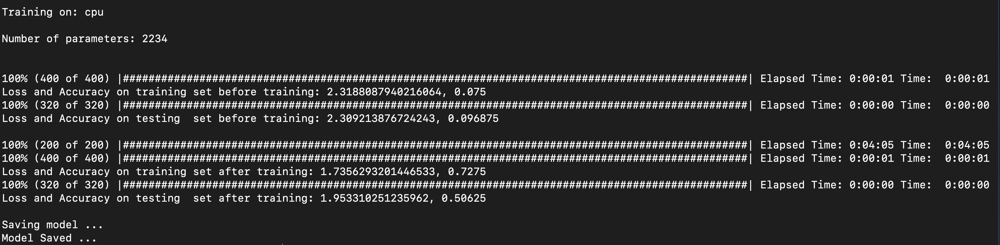

# Vision Transformer

## Train the model

`python3 train.py`

## Inference

- `python3 inference.py id`
- `id` is an integer([0, 10000]) representing the image index from the testing set.
- Since the model was training on a subset of MNIST, the accuracy is not high.

## Dataset

- Trained on a subset of MNIST due to limited computation power
- Training set contains 400 pictures
- Testing set contains 320 pictures

## Result

